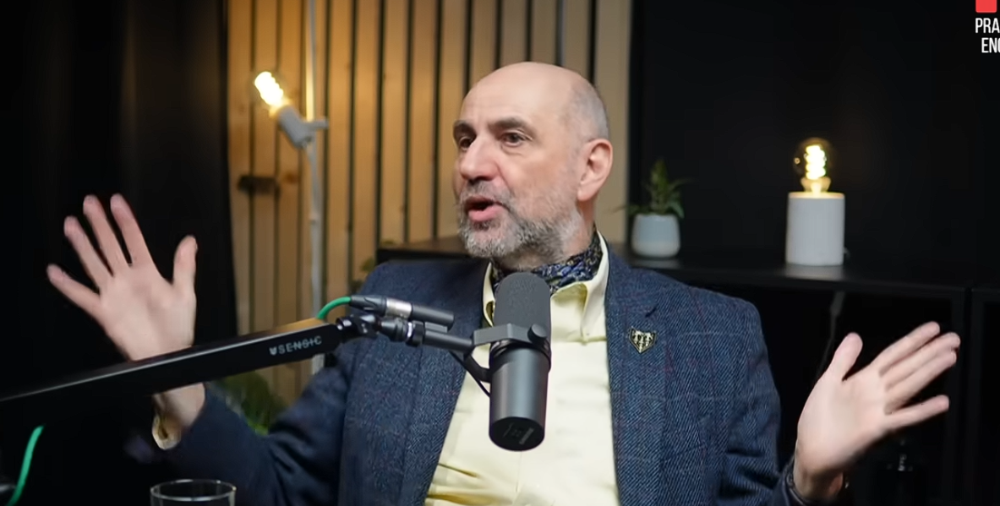

**สรุปบทสนทนาระหว่าง Martin Fowler และผู้ดำเนินรายการ** ในช่วงเวลา 00:00 ถึง 50:45
https://youtu.be/CQmI4XKTa0U?si=A5pytiMoHP4xNojT

โดย Martin Fowler เล่าว่าเขาเข้าสู่วงการซอฟต์แวร์แบบบังเอิญในช่วงปลายยุค 70 และงานแรกของเขาที่บริษัทที่ปรึกษาทำให้เขาได้เริ่มศึกษาเรื่อง Object-oriented ซึ่งตอนนั้นเรื่องนี้ล้ำมาก ต่อมาได้ร่วมงานกับ  Thoughtworks มากว่า 25 ปี ในตำแหน่ง Chief Scientist ประมาณว่าเป็นตำแหน่งที่มีหน้าที่แบ่งปันไอเดีย และอธิบายถึง Technology Radar ของ Thoughtworks ว่าเป็นเครื่องมือที่รวบรวมข้อมูลจากนักพัฒนาทั่วโลกเพื่อแนะนำเทคโนโลยีที่ควรนำมาใช้ (Adopt) หรือควรระวัง (Hold) และFowler มองว่า **การมาของ AI เป็นการเปลี่ยนแปลงครั้งใหญ่ในชึวิต** เทียบได้กับ **การเปลี่ยนจากภาษา Assembly มาเป็น High-level language** และจุดเปลี่ยนสำคัญคือจากโลกของ Determinism (ระบบที่คาดเดาผลลัพธ์ได้แน่นอน) ไปสู่ Non-determinism (ระบบที่ไม่แน่นอน) ซึ่งทำให้ความสำคัญของการสร้าง Abstraction เปลี่ยนไป โดยเราต้องเรียนรู้ที่จะใช้ภาษาที่รัดกุมในการสื่อสารกับ AI เพื่อให้ได้ผลลัพธ์ที่มีประสิทธิภาพ และ**ประโยชน์ก็มี ความเสี่ยงก็มา**โดยในปัจุบันมีประโยชน์อยู่ 2 หลัก คือการสร้างต้นแบบ และการทำความเข้าใจ Legacy Systems และ Fowler ก็เตือนเรื่องของ **Vibe Coding** ก็คือการเขียนโค้ดโดยที่เรานั้นไม่ได้ตรวจผลลัพธ์มันและไม่เข้าใจที่ AI มันสร้างขึ้น และมันทำลายการเรียนรู้ของนักพัฒนา โดย Fowler แนะนำแนวทางการพัฒนาซอฟแวร์ในยุค AI โดยหลักการ "Don't trust, but verify" ประมาณว่าอย่าเชื่อแต่ต้องตรวจสอบ ควรทำงานเป็นชิ้นเล็กและTestอยู่ตลอดเพื่อควบคุมคุณภาพและยังสื่อว่าการสื่อสารและการทำความเข้าใจความต้องการของผู้ใช้ เป็นทักษะที่สำคัญที่สุด

